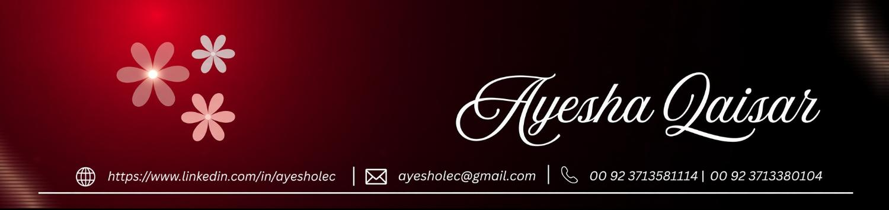

# National Youth Leadership Program (NYLP) — Official Portal



The official web portal for the **National Youth Leadership Program (NYLP-2025) — Leaders of the Nation**. A nationwide youth empowerment and leadership assessment platform connecting ambitious Pakistani youth with institutional training, mentorship, and authenticated certifications.

---

## 🌟 Key Features

- **Dynamic Portal & Adaptive Viewport**:
  - Seamless desktop & mobile experience with responsive screen-fitting hero section.
  - Dual-state architecture: Guest orientation showcase & authenticated Candidate Assessment Hub.
- **National Quiz Competition**:
  - 10-question leadership, governance, and diplomacy assessment.
  - Live integration with Google Apps Script backend and master question repository.
  - Immediate scorecard breakdown: Score, Percentage, Standing / Distinction, and unique Certificate ID.
- **Candidate Name Integrity & High-Resolution Certification**:
  - Full official candidate name persistence across registration, assessment, and certification.
  - Real-time HTML5 2000×1414 canvas generator with distinction templates (`First Position (Distinction)`, `Second Position (Merit)`, `Third Position / Participation`).
  - High-resolution PNG download and one-click PDF print formats.
- **Multi-Page Architecture**:
  - [`index.html`](index.html): Landing portal, mission metrics, and candidate auth gateway.
  - [`about.html`](about.html): Institutional mission, pillars, and leadership framework.
  - [`quiz.html`](quiz.html): Assessment engine, scorecard, and delayed certificate generator.
  - [`people.html`](people.html): Leadership directory featuring Founder & Chairman Khoja Sheraaz Ali, executive directorate, regional chapter heads, and fellows.
  - [`verify.html`](verify.html): Public certificate validation and verification registry.
  - [`contact.html`](contact.html): Official inquiries, partnerships, and institutional desk.

---

## 🛠️ Technology Stack

- **Frontend**: HTML5, Semantic CSS3, Tailwind CSS (CDN), Font Awesome 6.5.1
- **Typography**: Cormorant Garamond & Inter (Google Fonts)
- **Visuals & 3D**: Three.js WebGL Constellation Canvas
- **Certificate Engine**: HTML5 Canvas (2000×1414 resolution)
- **API Backend**: Google Apps Script REST endpoint for submissions and live questions

---

## 🚀 Running Locally

You can serve the static portal using any lightweight HTTP server:

```bash
# Using Python 3
python -m http.server 3000

# Using Node.js http-server / serve
npx serve .
```

Open [http://localhost:3000](http://localhost:3000) in your browser.

---

## 📜 License & Intellectual Property

&copy; 2026 National Youth Leadership Programme (NYLP). All rights reserved. Founded by Khoja Sheraaz Ali.
